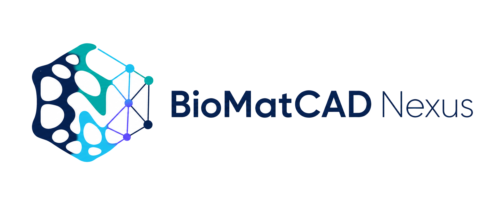

  

<h1 align="center">BioMatCAD Nexus</h1>

<em>Plataforma de engenharia computacional de biomateriais para pesquisa e validação pré-clínica</em>

> **Ambiente de pesquisa e validação pré-clínica. Não é dispositivo médico e não deve ser
> utilizado para decisão terapêutica ou com dados clínicos reais.**

## Estado atual

| Item | Status |
|---|---|
| Incremento 2.2 Alpha Pesquisa | **Encerrado** |
| Tag da release | `incremento-2.2-alpha-pesquisa-final` |
| Commit verificável | `37b0350` |
| Incremento 2.3 — Dados Científicos | Em desenvolvimento |

## Visão geral

O BioMatCAD Nexus é uma plataforma para projeto computacional de scaffolds/biomateriais:
definição paramétrica de receitas geométricas (BioMatCEM), geração real de geometria via
worker dedicado, visualização 3D interativa, rastreabilidade completa de artefatos e um módulo
de recomendação baseado em regras para apoiar — nunca substituir — o julgamento do
pesquisador. O projeto é derivado do doutorado de Adler Lima Botelho de Azevedo
(PPGBiotec/UFBA) e do `Prompt_Mestre_BioMatCAD_Nexus.md`.

## Capacidades já implementadas

- **Topologias de scaffold reais**: Gyroid (superfície mínima periódica) e Voronoi (células com
  struts), ambas geradas por um worker geométrico real sobre PicoGK — não são simulações ou
  substitutos.
- **Contrato de receita versionado** (`geometry-recipe-v1`), validado de forma idêntica no
  frontend e no backend contra o mesmo JSON Schema.
- **Pipeline de job completo**: API → fila PostgreSQL (claim atômico) → dispatcher →
  worker → STL → artefato → manifesto com SHA-256 rastreável em múltiplos pontos de
  verificação.
- **Visualizador 3D** do STL real (Three.js): órbita/pan/zoom, wireframe, transparência,
  eixos/grade, bounding box, corte (clipping), screenshot, tela cheia, cancelamento de
  download e descarte completo de recursos WebGL.
- **`DesignAdvisor` baseado em regras**: recomendações metodológicas determinísticas e
  rastreáveis (nunca uma decisão clínica), com regras versionadas e aviso fixo de ausência de
  validação clínica em toda saída.
- **Resiliência operacional**: recuperação de job órfão via heartbeat, detecção de checksum
  divergente e de saída parcial do worker, e sobrevivência do dispatcher a indisponibilidade
  transitória do banco.
- **Postura de segurança de pesquisa**: segregação por organização/projeto, autenticação
  `DEV_AUTH` classificada explicitamente, download sempre autenticado, sanitização de log,
  auditoria de ação — sem alegar conformidade clínica, LGPD completa ou certificação
  regulatória.

## Evidência consolidada do fechamento do Incremento 2.2

| Suíte | Resultado |
|---|---|
| Backend (`pytest`, Postgres real) | 259 passed, 2 skipped |
| Frontend (`vitest`) | 128/128 |
| Worker C# (`dotnet test`, 2 projetos) | 100/100 + 11/11 |
| Playwright — execução real no Windows | 15/15 |
| Matriz geométrica Gyroid/Voronoi | 6 golden recipes, 2 execuções cada, determinismo byte a byte |
| Typecheck, lint, builds (normal e GitHub Pages), scripts PowerShell | Verificados |

Relatório completo: `TEST_EVIDENCE.md` (histórico) e
`delivery/v2.2/TEST_EVIDENCE_v2.2_FINAL_REPORT.md` (relatório final consolidado).

## Arquitetura resumida

- **Backend**: FastAPI + PostgreSQL (SQLAlchemy/Alembic).
- **Frontend**: React + TypeScript + Vite + Three.js.
- **Worker de geometria**: .NET 9 + PicoGK.
- **Dispatcher**: processo separado, claim atômico de jobs, heartbeat e recuperação de órfãos.
- **Artefatos**: armazenamento com manifesto e checksum SHA-256 recalculado de forma
  independente em cada job.
- **`DesignAdvisor`**: módulo de recomendação baseado em regras versionadas, separado do
  contrato (`Protocol`) que o define.

Detalhamento completo em `ARCHITECTURE.md`.

## Início rápido no Windows

O guia de referência para restaurar e executar o sistema em Windows para fins de pesquisa é:

**[`delivery/v2.2/WINDOWS_RESEARCH_QUICKSTART.md`](delivery/v2.2/WINDOWS_RESEARCH_QUICKSTART.md)**

Cobre restauração a partir do bundle Git, pré-requisitos, execução do backend/worker/frontend,
e o gate final de confirmação (opcional).

## Documentos de referência

- **Release do Incremento 2.2**: tag `incremento-2.2-alpha-pesquisa-final` (commit `37b0350`) —
  manifesto completo em `delivery/v2.2/RELEASE_MANIFEST.md`, matriz de aceite em
  `delivery/v2.2/ACCEPTANCE_MATRIX.md`.
- `TEST_EVIDENCE.md` — log de evidência de teste de todo o histórico do projeto.
- `IMPLEMENTATION_STATUS.md` — inventário real vs. planejado, com evidências por item.
- `ROADMAP.md` — pendências reconciliadas e priorização dos próximos passos.
- `ARCHITECTURE.md` — arquitetura detalhada e o que dela está implementado.
- `REQUIREMENTS_MATRIX.md` — matriz de requisitos rastreável.
- `docs/security/RESEARCH_SECURITY_POSTURE.md` — postura de segurança do ambiente de pesquisa.
- `NOTICES.md` — atribuições de componentes de terceiros.

## Escopo do Incremento 2.3 — Dados Científicos

Este incremento está **em desenvolvimento** (branch `incremento-2.3-dados-cientificos`).
Rodada 1 (fundação canônica, proveniência e curadoria) e Rodada 2 (infraestrutura de ingestão
e primeiro conector real, PubChem PUG REST) estão implementadas e testadas — ver
`IMPLEMENTATION_STATUS.md` para o inventário completo com evidências, e
`docs/data/connectors/PUBCHEM_CONNECTOR.md` para o contrato do conector PubChem.

Escopo coberto até aqui:

- Banco de dados científico de materiais e propriedades, com proveniência completa por
  observação (`docs/data/SCIENTIFIC_DATA_MODEL.md`).
- Rastreabilidade de proveniência dos dados (origem, método de obtenção, incerteza).
- Primeiro conector real de ingestão externa (PubChem), com fila persistente, cliente HTTP
  restrito por allowlist, registro bruto versionado por checksum, e reconciliação que nunca
  funde entidades automaticamente.
- Curadoria: todo dado externo entra sempre como não revisado (`DRAFT`); promoção a
  `REVIEWED` exige decisão humana explícita, nunca automática.
- Interface web mínima (`/app/scientific-data` e `/app/scientific-data/:entityId`): listagem
  com busca/filtros, detalhe com 11 abas (identificadores, propriedades, proveniência,
  snapshots, referências, evidências biológicas, produtos de fornecedor, estruturas
  cristalográficas, conflitos, histórico de revisão), painel administrativo de ingestão PubChem
  (dry-run/submissão/status/cancelamento, restrito a admin, máximo 10 CIDs por solicitação), e
  avisos de uso responsável sempre visíveis — ver `docs/data/INGESTION_OPERATIONS.md` para como
  usar o painel e `apps/web/e2e/README.md` para os logins sintéticos e como reproduzir o E2E.

O conector PubChem foi validado até aqui apenas por teste de contrato sintético — o sandbox de
desenvolvimento bloqueia a rede real para `pubchem.ncbi.nlm.nih.gov` (ver seção de bloqueio de
rede em `docs/data/connectors/PUBCHEM_CONNECTOR.md`). A execução real contra a API oficial do
PubChem depende de rodar `apps/api/scripts/Run-PubChemPilotWindows.ps1` em uma máquina Windows
com rede normal.

Nenhuma capacidade deve ser considerada implementada até que apareça registrada, com evidência
de teste correspondente, em `IMPLEMENTATION_STATUS.md` e `TEST_EVIDENCE.md`.

## Limitações e uso responsável

- **Nunca usar com dados clínicos reais.** O sistema não é um dispositivo médico, não tem
  validação clínica, aprovação regulatória ou conformidade LGPD completa.
- O `DesignAdvisor` produz apenas recomendações metodológicas rastreáveis — nunca uma decisão
  clínica, nunca uma propriedade de material inventada.
- Launcher/instalador clínico completo, RBAC/ABAC completo (17 perfis), OIDC/MFA, FEM, DICOM,
  integração hospitalar e validação clínica permanecem fora de escopo.
- 7 avisos de dependências (`npm audit`) seguem formalmente deferidos, cada um com análise de
  alcançabilidade documentada em `docs/security/DEPENDENCY_AUDIT_2.2.md` — nenhum foi mascarado.

## Licença e atribuições

A licença do próprio código do BioMatCAD Nexus ainda **não foi definida** — ver
`LICENSE_PENDENTE.md`. As atribuições de componentes de terceiros (PicoGK/Apache-2.0,
three.js/MIT, e demais dependências) estão consolidadas em `NOTICES.md`.
